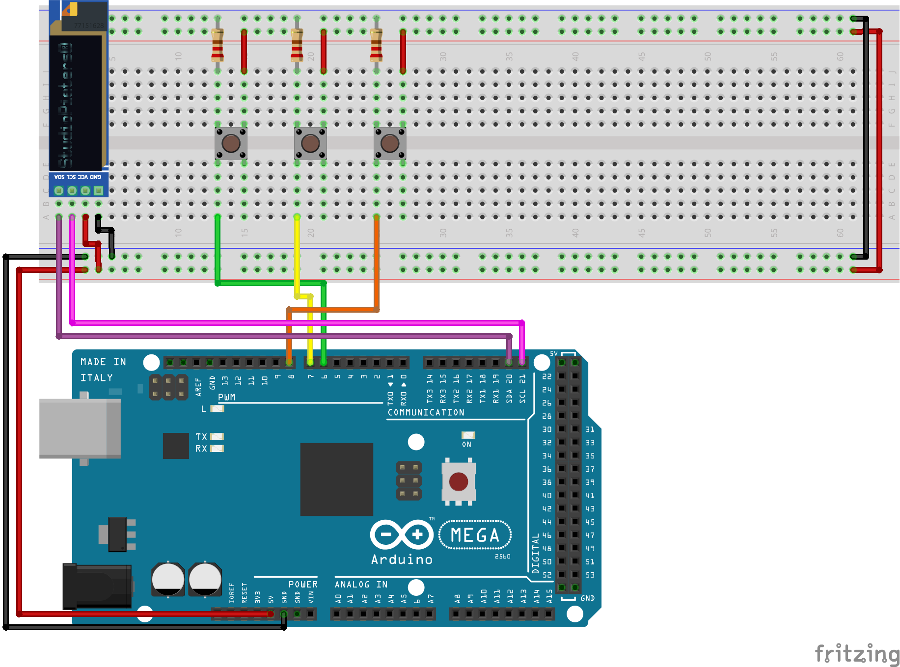

# Maartens birthday present of 2022

> :exclamation: Please read this text and complete everything before looking at the actual source code.

## Introduction

Dear Maarten. Every year again, we have the tradition to send eachother a programming puzzle, or develop something.
Now that we can actually celebrate your birthday in person, I'm not planning on changing that tradition.
So here it is, the present of this year!

Last year I developed [a tool where you could develop your own Happy Birthday message](https://maarten.mennovandenende.nl/).
Well develop... Let's say that randomly slamming keys on your keyboard would also have resulted in a working piece of code :wink:.
This year however, I've decided that you actually have to make your present yourself. This time not with code, but with hardware.

## Building the project

As said, you will have to build the hardware yourself. To make your life easier, I've included a schematic diagram below of how all wires and hardware should be connected. Please start building your device now using the diagram. Afterwards, please go to the next chapter.

- Red wires: 5 Volt power
- Black wires: Ground
- All other wires: Input/output/datatransfer wires
- Please note: I might not have brought the exact same color wires with me.

## Using the project

So I understand that you've built the hardware? Amazing, good to hear. It is almost time to boot it up. But first, let's explain what it is.
It's a mini-quiz! Answer all the questions correctly, and you will gain access to this year's surprise. It might also grant you access to your real birthday present, depending of the delivery time of PostNL. There might be a slight delay in that final part however. That's just something you have to accept when using cronjobs and API's to external parties...

Finally, here are some usage instructions:
- Top button: Reset / 0.
- Middle button: +1.
- Bottom button: Confirm / next.

I think it's time to begin! Please connect the Arduino to a working power source, and have fun!

## The code

And of course, I've written some code to make this all work. You can take a look at it, but only after you've done every step above.

Is it my best work so far? Certainly not. Am I proud of it? No, not at all. But does it work? Yes, of course! And was it fun? Yes it was. I even had to learn music again and read notes, that was some time ago!

By the way: I don't know who decided that the C language should have both a `.h` file and a `.cpp` file to make classes... But I chose not to apply such madness and just put almost everything in one file.
