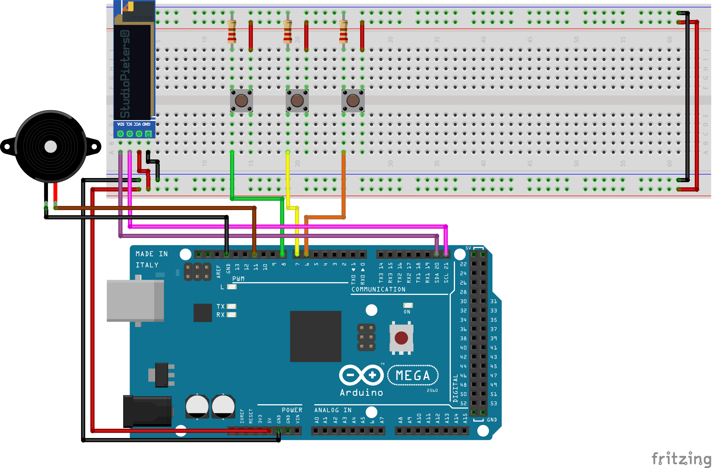

# Happy birthday Maarten! (version 2022)

This repository contains the Arduino code of your birthday quiz device.

## The schematic

## The code

It may be ugly but it works, that's all that matters.
Also, I don't know who decided that the C language should have both a `.h` file and a `.cpp` file... But I chose not to apply such madness and just put almost everything in one file.
